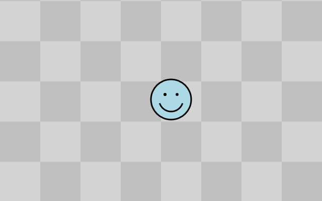
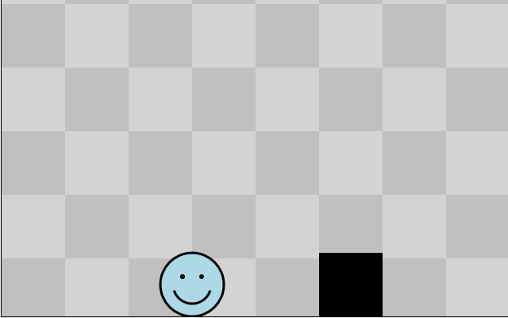
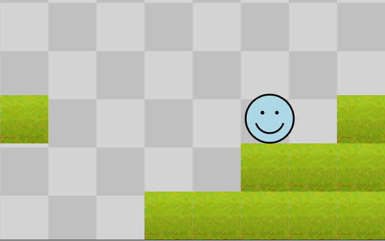
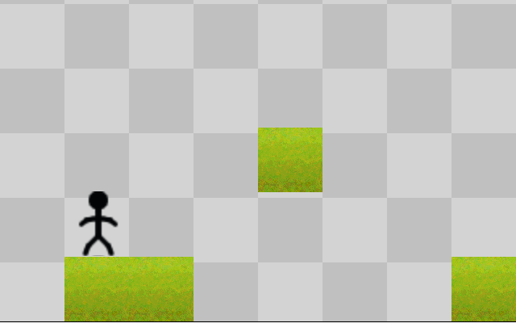
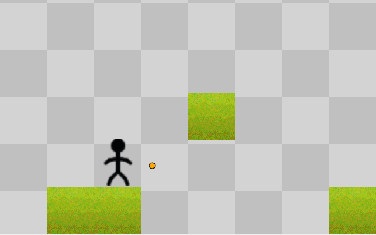
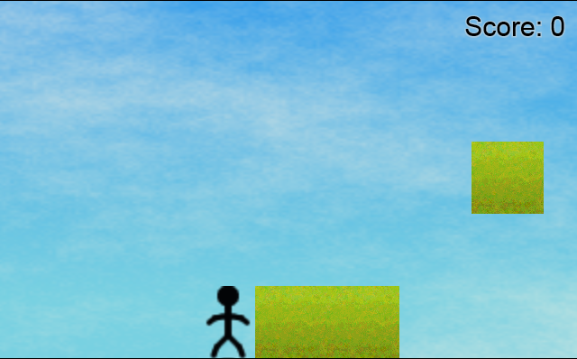
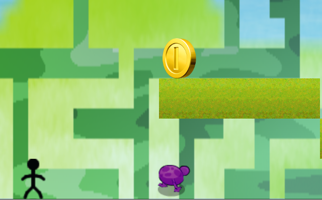

# H5CGB Basics Walkthrough - Build a Platformer

This guide introduces the rapid prototyping tools for JavaScript canvas
applications provided by
[HTML5 Canvas Game Boilerplate](https://github.com/IceCreamYou/HTML5-Canvas-Game-Boilerplate)
by using them to write a Mario-style platformer game.

## Default Project: main.js

H5CGB provides a lot of boilerplate out of the box, but there is really only
one file you need to focus on to write your application:
[main.js](https://github.com/IceCreamYou/HTML5-Canvas-Game-Boilerplate/blob/gh-pages/js/app/main.js).
(You will probably also want to tweak
[index.html](https://github.com/IceCreamYou/HTML5-Canvas-Game-Boilerplate/blob/gh-pages/index.html),
and possibly adjust its styling with
[main.css](https://github.com/IceCreamYou/HTML5-Canvas-Game-Boilerplate/blob/gh-pages/css/main.css).)
For the rest of this tutorial, all the code I'll be discussing goes in main.js
unless noted otherwise.

Although H5CGB is designed so that you should usually be able to write your
application without touching other files, you can dive in and modify other
things if you need to. The code is well-documented and there is lots of
[online documentation](https://github.com/IceCreamYou/HTML5-Canvas-Game-Boilerplate/wiki),
so you should be able to figure out how things work if you do want to change
the internals.

All of main.js, by default, is well under 100 lines of code. It consists of the
magic functions `setup()`, `draw()`, and `update()`, which do pretty much what
you would expect. Your movement/collision/update code goes in `update()`;
painting code goes in `draw()`; and setup goes in `setup()`. Here are the 20
lines of code sans comments and blank lines:

    var player;
    var keys = {
      up: ['up', 'w'],
      down: ['down', 's'],
      left: ['left', 'a'],
      right: ['right', 'd'],
    };
    var preloadables = [];
    function update() {
      player.update();
    }
    function draw() {
      context.drawCheckered(80, 0, 0, world.width, world.height);
      player.draw();
    }
    function setup(first) {
      world.resize(canvas.width + 200, canvas.height + 200);
      Actor.prototype.GRAVITY = false;
      player = new Player();
    }

If you go ahead and open index.html, here's what it will look like:

You can see the movement keys specified in the code -- use WASD or the arrow
keys to move around and try it. Already you've got a player character that can
move around in a "world" that scrolls around as the player approaches an edge.
We've written no code and we have a top-down RPG. If there was some grass on
the ground instead of the checkerboard, we'd practically have
[Pokémon](https://en.wikipedia.org/wiki/Pok%C3%A9mon_%28video_game_series%29).
But I'm getting ahead of myself.

## Side-Scrolling

We want to build a side-scrolling platformer, not a top-down adventure game, so
we need to make a simple change. See the line that says `GRAVITY` in it in
`setup()`? Switch the value there to `true` to (<em>surprise</em>) enable
gravity. Let's also change the size of our game world so our mustachioed
adventurer has a little more room to run around, and let's place him at the
"beginning" of the level instead of in the center.

    // world.resize() changes the size of the world, in pixels; defaults to the canvas size
    world.resize(canvas.width + 1200, canvas.height + 200);

    // the GRAVITY property enables gravity
    Actor.prototype.GRAVITY = true;

    // the arguments to create a new player specify its pixel coordinates
    // upper-left is (0, 0)
    player = new Player(200, 200);

Refresh the page and you should see your smiley-face character fall to the
ground. Try jumping around a bit and moving to the sides so you can see that
the world still scrolls. Cool! (Note that all the movement mechanics are
[configurable](http://icecreamyou.github.io/HTML5-Canvas-Game-Boilerplate/docs/#!/api/Actor).)

## Boxes, Collision, and Images

Mario would be no fun if he just ran around on flat terrain all the time. We
need platforms and things to jump over! Let's put a
[Box](http://icecreamyou.github.io/HTML5-Canvas-Game-Boilerplate/docs/#!/api/Box)
into the world. Put this at the bottom of `setup()`:

    // Add terrain.
    solid = new Box(world.height - Box.prototype.DEFAULT_HEIGHT, 400);

If you refresh the page, you'll notice your Box isn't visible. That's because
we're not drawing it yet. In the `draw()` function, add:

    solid.draw();

We have a box!

Sadly, if you try running around, you'll notice that your player doesn't
collide with the box. Let's fix that. Replace the contents of update() with
this:

    // move
    player.update();
    // enforce collision
    player.collideSolid(solid);

Success!

Plain black boxes are okay, but let's spice it up a little by using an image. Just put this line after initializing the box during setup():

    solid.src = 'path/to/image.png';

Here's the image I used:

You should also add the image to the `preloadables` array at the top of main.js
so that it is cached before animation starts:

    var preloadables = ['path/to/image.png'];

Voilà!

## TileMaps

A world with one box isn't much of a world at all. Let's build some more
interesting terrain. Back in setup(), instead of adding a new Box, let's add a
[TileMap](http://icecreamyou.github.io/HTML5-Canvas-Game-Boilerplate/docs/#!/api/TileMap).
TileMaps are basically helpers to initialize and manage grids of objects. Using
them is fairly intuitive:

    // Add terrain.
    var grid =  "         B      BB        \n" +
                "              BBBBBB      \n" +
                "      BB    BBBBBBBBBB  BB";
    solid = new TileMap(grid, {B: Box});

You can probably tell what's going on here: the "grid" string represents our
layout, where spaces represent empty spaces and B's become new Boxes as
specified in the map we're passing to TileMap as the second parameter. There
are a couple of different ways to initialize TileMaps, but this is the easiest.

If you refresh the page you'll see that all the new boxes are drawn and your
player collides with them. That's because we already had `solid.draw()` and
`player.collideSolid(solid)` in our `draw()` and `update()` functions,
respectively, and those methods work the same way for TileMaps as they do for
Boxes.

Unfortunately our boxes are all black again. That's because when you initialize
a TileMap this way, it uses the default constructor for the objects it creates.
There are four common ways to do this, but the easiest is to simply pass the
file path of your image to the TileMap. Doing so will automatically create
Box-like objects using that image.

    solid = new TileMap(grid, {B: 'path/to/image.png'});

There are lots of fun things we can do with TileMaps; this is just a taste.

**Quick recap:** we've only added or changed around a dozen lines of code, and
we already have a character who can run/jump around and collide with textured
objects in a map layout.

## Sprites and SpriteMaps

Now, our smiley face is pretty sweet, but we can't go about smiling all the
time when we're stomping baddies. We need a hero with some expression. A hero
with *moves*. A hero like... *StickMan!*

Here's a simple sprite we'll use for testing sprite animation:

Whatever image you use, remember to add it to the `preloadables` array at the
top of main.js so that it will be loaded and cached before animation starts.

Let's assign the sprite to our player in `setup()`. Notice that the sprite
we're using has several different animation sequences in it, so we'll use a
[SpriteMap](http://icecreamyou.github.io/HTML5-Canvas-Game-Boilerplate/docs/#!/api/SpriteMap)
to keep track of them. SpriteMaps are basically wrappers around
[Sprite](http://icecreamyou.github.io/HTML5-Canvas-Game-Boilerplate/docs/#!/api/Sprite)s
that make it easier to switch between different animation sequences. If you
just have one animation sequence that you want to run continuously, you could
assign a Sprite to `player.src` instead; you'd leave out the parameter that
specifies the animation sequences, but otherwise it works the same way.

    // Notice the two new parameters to Player(); they are width and height.
    // We're changing the player's dimensions to match the width:height ratio of the image.
    player = new Player(200, 200, 60, 80);
    // Initialize the SpriteMap by giving it an image file, a map of animation sequences, and settings.
    player.src = new SpriteMap('path/to/image.png', {
      stand: {
        startRow: 0,
        startCol: 5,
        endRow: 0,
        endCol: 5,
      },
      left: {
        startRow: 0,
        startCol: 0,
        endRow: 0,
        endCol: 4,
      },
      right: {
        startRow: 1,
        startCol: 0,
        endRow: 1,
        endCol: 4,
      },
      // More animation loops omitted for brevity...
    }, {
      frameW: 30, // frame width
      frameH: 40, // frame height
      interval: 75, // time delay between switching frames
      useTimer: false, // use the animation cycle instead of a setInterval() timer to update frames
    });

This is the long form of the `SpriteMap()` constructor. The map of animation
sequences is easy to read &mdash; the outer keys are the names of the sequence,
and the inner maps specify the starting and ending frames for each sequence.
This can get long and tedious to write out though, so there's a more concise
version as well:

    player = new Player(200, 200, 60, 80);
    player.src = new SpriteMap('path/to/image.png', {
      stand: [0, 5, 0, 5],
      fall: [0, 5, 1, 5, true],
      left: [0, 0, 0, 4],
      right: [1, 0, 1, 4],
      lookLeft: [0, 2, 0, 2],
      lookRight: [1, 2, 1, 2],
      jumpLeft: [0, 4, 0, 4],
      jumpRight: [1, 4, 1, 4],
    }, {
      frameW: 30,
      frameH: 40,
      interval: 75,
      useTimer: false,
    });

Much shorter, and still not to bad to read. Hooray, StickMan!

If you copied the code above, you may be surprised to see that your animations
already work. That's because there are certain magic-named animation sequences
that run automatically. If you want to add animations that aren't covered, use
different names for the animation sequences, or run the animations at different
times, you can override the
[`updateAnimation()`](http://icecreamyou.github.io/HTML5-Canvas-Game-Boilerplate/docs/#!/api/Actor-method-updateAnimation)
method from the Actor class (that link goes to the documentation for that
method, which lists the magic animation sequence names). More on inheritance
below.

## Inheritance, Keyboard Input, Collections, and Fireballs

Fire! Balls! Balls of fire! Time to shoot some fireballs. In order to do this,
we're going to listen for the "shoot" button to be pressed, create a new
instance of a Bullet class we'll create, and add that instance to a set of all
our bullets for easier maintenance. This will be by far the most code we'll
need to add.

First, above `update()`, let's create a set that we'll use to keep track of the
bullets we've fired:

    /**
     * All our Bullets.
     */
    var bullets = new Collection();

[Collection](http://icecreamyou.github.io/HTML5-Canvas-Game-Boilerplate/docs/#!/api/Collection)s
are sets of things. They let you keep track of them easily and perform
operations on all the items in the set at once. They're a lot like TileMaps
except they don't keep track of their items' placement relative to each other.

Next, let's create a Bullet class. We have a class/inheritance framework
available to us as
[defined by John Resig](http://ejohn.org/blog/simple-javascript-inheritance/)
(creator of jQuery). New child classes are created using the
[`Class.extend()`](http://icecreamyou.github.io/HTML5-Canvas-Game-Boilerplate/docs/#!/api/Class)
method, and the `init()` method of the new class runs when it is instantiated.
We've already been using the
[Box](http://icecreamyou.github.io/HTML5-Canvas-Game-Boilerplate/docs/#!/api/Box)
class, which is the parent of most things you'll want to put in your world, and the
[Player](http://icecreamyou.github.io/HTML5-Canvas-Game-Boilerplate/docs/#!/api/Player)
class, which is controlled by the user's keyboard. Player inherits from
[Actor](http://icecreamyou.github.io/HTML5-Canvas-Game-Boilerplate/docs/#!/api/Actor),
which is a child of Box that adds movement mechanics. We're going to extend
Actor with a new class called Bullet.

    /**
     * The Bullet class.
     */
    var Bullet = Actor.extend({
      // Override Actor default properties.
      MOVEAMOUNT: 800, // Bullet velocity in pixels per second
      GRAVITY: false, // Just keep going rather than falling down
      CONTINUOUS_MOVEMENT: true, // Keep going in the last specified direction
      STAY_IN_WORLD: false, // Let our bullets leave the world (we'll destroy them when they do)
      DEFAULT_WIDTH: 10,
      DEFAULT_HEIGHT: 10,
      /**
       * Initialize a Bullet.
       *
       * @param direction
       *   An array of keys representing the Bullet's initial direction.
       * @param x
       *   The x-coordinate of the top-left corner of the Bullet.
       * @param y
       *   The y-coordinate of the top-left corner of the Bullet.
       */
      init: function(direction, x, y) {
        // Invoke the parent's init() function, Actor.prototype.init().
        this._super(x, y);
        // Store the direction we want the bullet to go. The CONTINUOUS_MOVEMENT
        // setting uses this property to keep going in the specified direction.
        this.lastLooked = direction;
      },
      /**
       * Override drawDefault() to draw a bullet when there isn't an image associated with it (src === null).
       */
      drawDefault: function(ctx, x, y, w, h) {
        // This draws a circle onto the graphics context (i.e. the canvas).
        // Parameters are x-coordinate of center, y-coordinate of center, radius, fill color, border color
        ctx.circle(x + w/2, y + w/2, (w + h) / 4, 'orange', 'black');
      },
    });

That wasn't so bad. We really just needed to override a few settings from Actor
and to make sure we store the bullet's direction. Now we're ready to create new
bullets when the player presses the "shoot" button. First, let's actually
define what the shoot button is. At the top, where the `keys` object is
defined, add your shoot key:

    var keys = {
      up: ['up', 'w'],
      down: ['down', 's'],
      left: ['left', 'a'],
      right: ['right', 'd'],
      shoot: ['space'], // Add this one
    };

Now let's listen for that key to be pressed. We're also going to put in a rate limit. Put this code after your Bullet class:

    /**
     * The minimum number of milliseconds that must pass between firing bullets.
     *
     * Set to 0 (zero) for no limit.
     */
    Bullet.fire_rate = 250;

    /**
     * Bind to the "shoot" key(s) and create a new bullet.
     *
     * Change keyup to keydown to be able to hold down the shoot key.
     */
    jQuery(document).keyup(keys.shoot.join(' '), function() {
      var now = Date.now();
      // Throttle bullet firing.
      if (now > (player._lastFired || 0) + Bullet.fireRate && isAnimating()) {
        player._lastFired = now;
        // Shoot in the direction the player looked last (default to right).
        var direction = player.lastLooked.length ? player.lastLooked : keys.right;
        // Center on the player.
        var x = player.x + player.width * 0.5,
            y = player.y + player.height * 0.5;
        // Add the new bullet to our Collection.
        bullets.add(new Bullet(direction, x, y));
      }
    });

There are a few things to note here. First, you can bind keyboard events to
specific key combinations by passing the key combinations as the first
parameter to `keyup`/`keydown`/`keypress` events. Separate combinations to
listen for with spaces, and combine keys that need to be pressed at the same
time with a plus sign (+). For example, to listen to Shift + A or the Down
arrow key, you'd use `"shift+a down"` as the first parameter to `keyup()`,
`keydown()`, or `keypress()`. Second, the `lastLooked` property on Actors and
their descendants is an array of directions (like the ones you specified in the
`keys` object) indicating the last direction in which the Actor looked. Third,
when we initialize a new bullet by calling `new Bullet()`, the parameters we
pass to `Bullet()` go straight to the `Bullet.prototype.init()` function. And
finally, the `add()` method is one way to add things to a Collection.

Also make sure to draw the bullets in the magic `draw()` function:

    bullets.draw();

...and move them around in `update()`:

    // The forEach() method runs the specified function on every item in the
    // Collection. forEach() can also take a string, which is interpreted as a
    // method name; for example, bullets.forEach('update') would execute each
    // bullet's "update" method.
    // TileMaps have a forEach() method as well that works the same way.
    bullets.forEach(function(bullet) {
      bullet.update();
      // Returning true removes the bullet from the collection.
      // Destroy the bullet if it hits a solid or goes out of the world.
      return bullet.collides(solid) || !world.isInWorld(bullet, true);
    });

Note that all Boxes have a `collides()` method which, like Actors'
`collideSolid()` method, accepts a Box, Collection, or TileMap. By default it
returns the first item with which it overlaps, or `false` if it doesn't overlap
with anything. Also, the `world` object represents the entire map. We're
already using it in `setup()` where we resized the playable area with
`world.resize()`. Here we're asking if the bullet is within the playable area,
and if not, we're returning `true` to destroy it.

That's it &mdash; we can now shoot bullets when we press the right key, and our
bullets collide with our world geometry.

**Quick recap:** At this point we've got around 180 lines of code. We've got a
player animated with sprites, a side-scrolling game world with gravity, level
geometry that supports images and collision, and the ability to shoot fireballs
when we press keys on the keyboard. We've learned how to manage Boxes,
Collections, TileMaps, drawing and updating, collision, classes and
inheritance, gravity, keyboard input, and scrolling. In other words, we've
learned pretty much everything we need to make most games!

## Layers

So far, we've drawn everything directly onto the canvas in every frame of
animation. This works, but it's not very efficient. Our background (currently a
checkerboard) and our level geometry (the grass in our TileMap) don't ever
move, so they only need to be painted once, whereas the player and bullets move
in practically every frame and need to be painted all the time. Also, at some
point we may want to draw text onto the screen as part of a HUD (Heads-Up
Display) -- for example, to display the score and the player's remaining lives;
and text renders very slowly, so having to render it in every frame will
immediately make our project unusable. To resolve this dilemma, we use
[Layer](http://icecreamyou.github.io/HTML5-Canvas-Game-Boilerplate/docs/#!/api/Layer)s,
which are intermediate canvases we can draw onto in order to cache the display
and draw it more quickly onto the main canvas.

We're going to create two layers: one for the background image and level
geometry and one for the HUD. Here's the code that goes at the bottom of
`setup()`:

    // Set up the static background layer.
    // By default, layers scroll with the world.
    bkgd = new Layer({src: 'path/to/image.png'});
    solid.draw(bkgd.context);

    // Set up the Heads-Up Display layer.
    // This layer will stay in place even while the world scrolls.
    hud = new Layer({relative: 'canvas'});
    hud.context.font = '30px Arial';
    hud.context.textAlign = 'right';
    hud.context.textBaseline = 'top';
    hud.context.fillStyle = 'black';
    hud.context.strokeStyle = 'rgba(211, 211, 211, 0.5)';
    hud.context.lineWidth = 3;
    hud.context.strokeText('Score: 0', canvas.width - 15, 15);
    hud.context.fillText('Score: 0', canvas.width - 15, 15);

The `context` property of a Layer is a Canvas 2D Graphics Rendering Context.
That is, it's the same kind of thing you would use to draw if you didn't use
this framework and just built the whole thing from scratch. You can draw
directly onto it with normal Canvas commands like we're doing here with
`fillText()` and `strokeText()`. Boxes, Collections, and TileMaps all have
`draw()` methods that take a graphics context as their first parameter (if you
don't pass anything they'll default to drawing onto the main canvas). We're
using this in our call to `solid.draw()`.

While we're on the topic, note that H5CGB overrides the native
[`drawImage()`](http://icecreamyou.github.io/HTML5-Canvas-Game-Boilerplate/docs/#!/api/CanvasRenderingContext2D-method-drawImage)
method for performance and flexibility. You can use it to draw almost anything
efficiently onto the canvas or a Layer. The Box/Actor/Player, Collection, and
TileMap `draw()` methods use this under the hood.

We also need to change the magic `draw()` function to actually use our Layers:

    function draw() {
      bkgd.draw();
      solid.draw();
      player.draw();
      bullets.draw();
      hud.draw();
    }

Finally, make sure to add your background image's file path to the
`preloadables` array.

In addition to background and foreground caches, Layers are useful when a group
of many independently-drawn entities needs to move together at once. You can
simply draw them one time onto a Layer and then draw that Layer as a single
image rather than rendering all its components again.

Layers also support [parallax](https://en.wikipedia.org/wiki/Parallax)
scrolling.

## Exercises for the Reader

We've now gone through all the rapid prototyping tools that are useful in
setting up a platformer game. There are some features that are missing from the
game we've built compared to the Mario games, most notably enemies and coins.
These can be written with the tools we've already encountered, so they're not
covered here for brevity. It's a good exercise to implement these features
yourself. If you get stuck or want to see the end product, you can
[play with](http://icecreamyou.github.com/HTML5-Canvas-Game-Boilerplate/examples/mario.html) or
[read the code](https://github.com/IceCreamYou/HTML5-Canvas-Game-Boilerplate/blob/gh-pages/examples/mario.js)
of a more complete example.

## Recap

We've implemented quite a lot of powerful features in under 200 lines of code.
Your game is already fun to play with, and with some polish, it will be ready
to show off to your friends!

These tools are quite flexible and are useful in many different scenarios
beyond a Mario game. You can
[read the complete API reference](http://icecreamyou.github.io/HTML5-Canvas-Game-Boilerplate/docs/) or
[view a comprehensive feature list](https://github.com/IceCreamYou/HTML5-Canvas-Game-Boilerplate/wiki/What%27s-Included-&-API-Overview)
to get more familiar with them. Also feel free to dig through the code; it's
well-documented.

The one major feature set we didn't cover is mouse interactions. There is a lot
to cover there, so it will be addressed in a separate tutorial.

Congratulations! Go
[get the code](https://github.com/IceCreamYou/HTML5-Canvas-Game-Boilerplate) if
you haven't already, and build something awesome!
